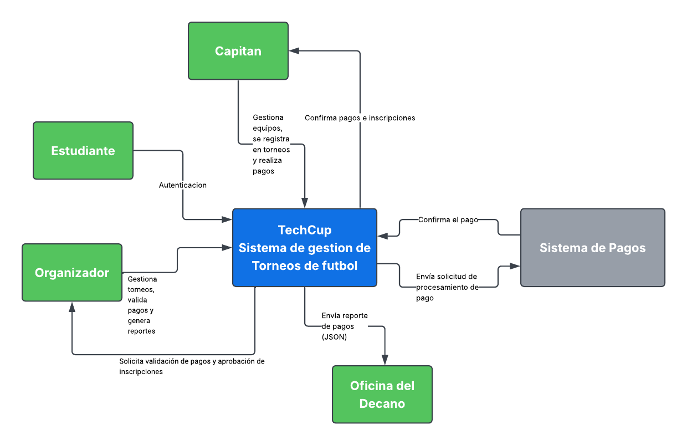

# 📄 Requerimientos del Sistema

## 1. Sistema

* Nombre del sistema: TechCup
* Objetivo: El sistema tiene como objetivo: 
    * Digitalizar y centralizar la gestión del torneo semestral de futbol de los programas de ingenieria de Sistemas, Inteligencia artificial, Ciberseguridad y Estadistica de la Escuela Colombiana de Ingenieria Julio Garavito.
    * Permitir la creacion de torneos, registro de equipos, procesamiento y validacion de pagos de inscripcion, y la generacion de reportes para los organizadores y la Decanatura.

## 2. Problema a resolver

Actualmente la Escuela no cuenta con un sistema centralizado para gestionar el torneo de futbol entre programas. La creacion de torneos, el registro de equipos, el cobro y validacion de los pagos de inscripcion, la consulta de equipos resgistrados y la generacion de reportes se realiza de forma manual o fragmentada, sin una herramienta que garantice el cumplimiento de las reglas del torneo ni que facilite la interaccion segura y simple entre estudiantes, capitanes de equipo y organizadores.

## 3. Diagrama de Contexto

### 3.1 Diagrama

### 3.2 Actores

| Actor / Rol | Descripción |
|-------------|:-----------:|
| Estudiante | Usuario del sistema que se autentica con usuario y contraseña. Representa a los miembros de la comunidad academica que pueden acceder a la plataforma. |
| Capitan | Estudiante responsable de un equipo. puede crear el equipo, actualizar su informacion, registrar el equipo en el torneo activo y realizar el pago de la inscripcion. |
| Organizador | Usuario encargado de administrar el torneo. Puede crear torneos, cambiar su estado, actualizar su informacion, revisar y validar pagos, aprobar inscripciones y generar reportes. |
| Oficina del Decano | Receptor del reporte de pagos de inscripcion, el cual se le envia en formato JSON. |

### 3.3 Sistemas externos

| Sistema | Descripcion |
|---------|:-----------:|
| Sistema de pago | sistema de pagos en linea a traves de la cual los equipos realizan el pago de la tarifa de inscripcion al torneo. TechCup envia la solicitud de procesamiento y recibe la confirmacion del pago. |

## 4. Alcance del sistema
   
### 4.1 Dentro del sistema

- Autenticacion de usuarios (organizadores y estudiantes) mediante usuario y contraseña.
- Creacion y gestion de torneos (informacion basica, estado, regla).
- Creacion y gestion de equipos (creacion, actualizacion de informacion).
- Registro de equipos en el torneo activo.
- Procesamiento del pago de inscripcion de un equipo a traves del sistema de pagos.
- Validacion de pagos y aprobacion de inscripciones por parte de los organizadores.
- Consulta del pago realizado por un equipo.
- Generacion de reportes de equipos registrados por torneo.
- Generacion de reportes de ingresos por inscripciones.
- Envio del reporte de pagos de inscripcion en formato JSON a la oficina del Decano.

### 4.2 Fuera del sistema

- Procesamiento interno de la transaccion de pago (lo realiza directamente el sistema de pagos; TechCup solo envia la solicitud y recibe la confirmacion).
- Gestion de la logistica deportiva del torneo (calendario de partidos, arbitros, canchas, resultados de los encuentros).
- Comunicacion directa con los estudiantes fuera de la plataforma (Comunicaciones como notificaciones por correo electronico o mensajeria).
- Eliminacion de torneos, dado que prevalece la regla de negocios sobre no eliminar torneos.

