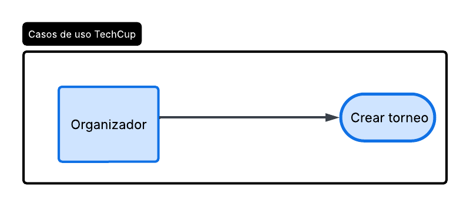
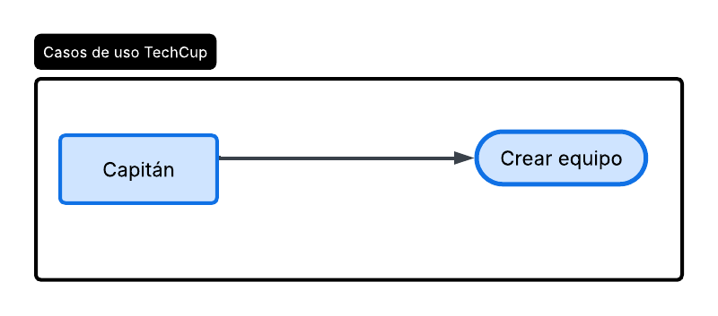
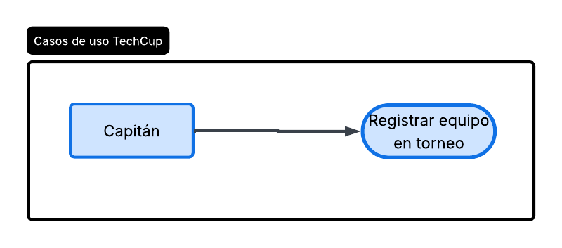

# 📄 Requerimientos del Sistema

## 1. Lista general de requerimientos

El sistema de TechCup tiene los siguientes requerimientos:

### 1.1 Requerimientos funcionales

El sistema de TechCup debe tener las siguientes capacidades:

1. Los organizadores deben poder crear un torneo especificando su informacion basica (fechas, tarifa de inscripcion, reglas).
2. Los capitanes deben poder crear su equipo.
3. Los capitanes deben poder registrar a su equipo en el torneo actualmente activo.
4. Los organizadores pueden validar el pago de inscripcion de un equipo.
5. Los organizadores pueden generar un reporte de equipos registradosa al torneo activo.

### 1.2 Requerimientos no funcionales

El sistema de TechCup debe tener:

1. El sistema debe garantizar en todo momento el cumplimiento de las reglas de negocio evitando estados inconsistentes en los datos.
2. El sistema debe estar disponible durante los periodos de inscripcion a torneos, minimizando el tiempo de inactividad.
3. La interfaz debe ser simple e intuitiva para la facil manipulacion de los usuarios.
4. El sistema debe garantizar que la informacion de pagos e inscripcion no se pierda ni se corrompa ante fallos.
5. El sistema debe poder procesar el registro de equipos y confirmaciones de pagos de un equipo en un tiempo de respueta corto.

## 2. Diagramas de caso de uso

### 2.1 Requerimiento Funcional 1

| Campo | Descripción |
|------|-------------|
| **ID** | RF-01 |
| **Nombre del requerimiento** | Crear torneo |
| **Descripción** | El sistema debe permitir a un organizador crear un nuevo torneo, especificando su informacion basica: fecha, tarifa de inscripcion y reglas del torneo. |
| **Precondiciones** | El usuario debe estar autenticado como organizador. No debe existir otro torneo en estado Activo al momento de crear uno nuevo. |
| **Actor** | Organizador |
| **Flujo principal** | El organizador solicita crear un nuevo torneo. --> El sistema solicita la informacion basica del torneo --> El organizador ingresa la informacion y confirma --> El sistema valida los datos --> El sistema registra el torneo en estado pendiente. |
| **Diagrama de caso de uso** | |
| **Poscondiciones** | El torneo queda creado en el sistema con estado pendiente, disponible para que un organizador cambie su estado posteriormente. |

### 2.2 Requerimiento Funcional 2

| Campo | Descripción |
|------|-------------|
| **ID** | RF-02 |
| **Nombre del requerimiento** | Crear equipo |
| **Descripción** | El sistema debe permitir a un capitan crear un equipo, ingresando la informacion basica del mismo. |
| **Precondiciones** | El usuario debe estar autenticado como capitan. |
| **Actor** | Capitan |
| **Flujo principal** | El capitan solicita crear un equipo --> El sistema solicita la informacion del equipo --> El capitan ingresa la informacion y confirma. --> El sistema valida los datos y registra el equipo. |
| **Diagrama de caso de uso** |  |
| **Poscondiciones** | El equipo queda creado en el sistema, disponibilidad para que el capitan lo registre posteriormente en un torneo activo. |

### 2.3 Requerimiento Funcional 3

| Campo | Descripción |
|------|-------------|
| **ID** | RF-03 |
| **Nombre del requerimiento** | Registrar equipo en torneo activo |
| **Descripción** | El sistema debe permitir a un capitan registrar su equipo en el torneo que se encuentre actualmente en estado activo. |
| **Precondiciones** | El equipo debe existir previamente. Debe existir un torneo en estado activo. El equipo no debe estar ya registrado en el torneo activo. |
| **Actor** | Capitan |
| **Flujo principal** | El capitan solicita registrar su equipo en el torneo activo. --> El sistema verifica que exista un torneo activo y que el equipo cumpla las condiciones para inscribirse. --> El sistema asocia el equipo al torneo activo. --> El sistema notifica al capitan que el registro fue exitoso y queda pendiente el pago de inscripcion. |
| **Diagrama de caso de uso** |  |
| **Poscondiciones** | El equipo queda asociado al torneo activo, en estado de inscripcion pendiente de pago. |

### 2.4 Requerimiento Funcional 4

| Campo | Descripción |
|------|-------------|
| **ID** | RF-04 |
| **Nombre del requerimiento** | Registrar equipo y pagar inscripción (PSE) |
| **Descripción** | El sistema debe permitir al capitán crear o seleccionar un equipo, registrarlo en el torneo activo y realizar el pago de la inscripción mediante PSE. |
| **Precondiciones** | Para que el sistema cumpla con este requerimiento, el capitán debe estar autenticado, debe existir un torneo en estado Active y el equipo debe cumplir las condiciones establecidas para la inscripción. |
| **Actor** | Capitán |
| **Flujo principal** | 1. El actor ingresa al módulo de equipos. 2. El actor crea un equipo o selecciona un equipo previamente registrado. 3. El sistema verifica que exista un torneo activo. 4. El sistema muestra la información del torneo y el valor de la inscripción. 5. El actor solicita registrar el equipo en el torneo. 6. El sistema verifica que el equipo pueda registrarse en el torneo activo. 7. El sistema solicita realizar el pago de la inscripción. 8. El actor selecciona PSE y realiza el pago. 9. El sistema procesa y registra la información del pago. 10. El sistema registra la solicitud de inscripción del equipo. 11. El organizador puede revisar y validar el pago para aprobar la inscripción. |
| **Diagrama de caso de uso** | [Ver prototipo en Figma](https://www.figma.com/design/sPneiN277qPumPLp93VDQk/Registrar-equipo-y-pagar-inscripción--PSE-?node-id=1-4253&p=f&t=MoctisQ6T4821Ldh-0) |
| **Mockup y flujo de navegación** |      |
| **Poscondiciones** | El pago queda registrado y el equipo queda asociado al torneo activo. La inscripción podrá ser aprobada por el organizador después de verificar el pago. |

## 3. Preguntas

I. ¿Identifica algún requisito que deba detallarse más? ¿Cuál(es)?

- se considera que se deberia detallar la informacion que se desea tener para los reportes de pago de las inscripciones.
- se deberia aclarar la informacion que se suministrara al torneo mas alla de solo "informacion basica"; tambien se deberia aclarar concretamente si las reglas suministradas del torneo son solo una lista de reglas a seguir por parte de los participantes o reglas que el sistema debe hacer cumplir para cada torneo.

II. ¿Existen requisitos que se contradigan entre sí? ¿Cuál(es)?

- se encontro entre los requisitos dos que se contradicen generando un conflicto. En el Estudio de caso en la seccion de reglas comerciales generales, se menciona un requisito que explicitamente dice "Los torneos no se pueden eliminar", y en la seccion subsecuente Funcionalidades generales hay un requisito ambiguo que, segun el contexto, parece que se solicita que los organizadores puedan "Eliminar un torneo y sus equipos registrados". estos dos requisitos llevan a una contradiccion en la cual no se puede cumplir con uno si incumplir con el otro.

III. Si tuviera que priorizar los requisitos, ¿cuáles 2 requisitos deberían considerarse los más importantes e implementarse en la primera iteración del proyecto?

- El primer requisito a priorizar deberia ser la autenticacion de un usuario en un rol especifico, ya que esto es lo que divide y asigna las responsabilidades a cada usuario para desempeñar su papel en el sistema y comenzar el flujo principal del mismo.
- El segundo deberia ser la creacion de los equipos ya que son parte primordial de todo el sistema y un elemento base para la creacion de todo torneo.

IV. ¿Existe algún requisito que no deba implementarse?

- No se deberia implementar la gestion de las transacciones de pago, ya que esto corresponde a las entidades bancarias correspondientes con las que los capitanes hagan los pagos.
- No se deberia implementar la funcionalidad de eliminacion de los torneos por parte de los organizadores, esto con el proposito de complir las reglas comerciales, ademas de haber consultado con las personas pertinentes y confirmando la prioridad del requisito de no poder eliminar torneos.